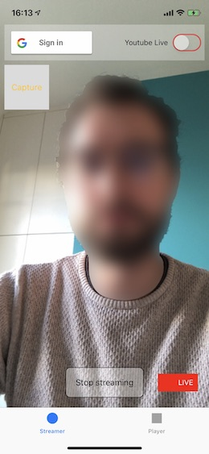
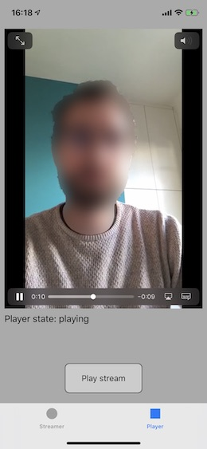
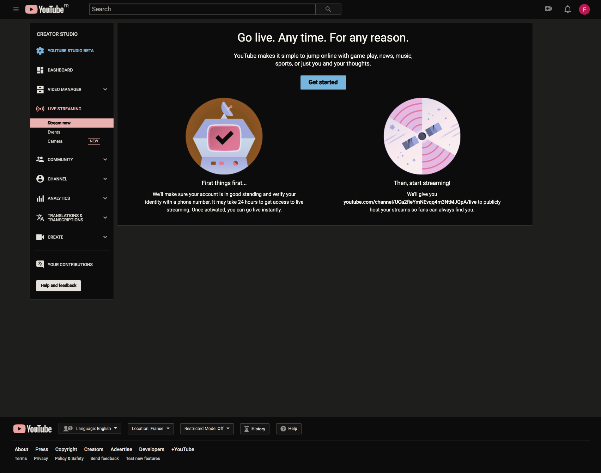
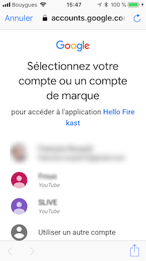
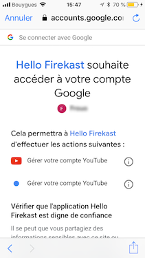
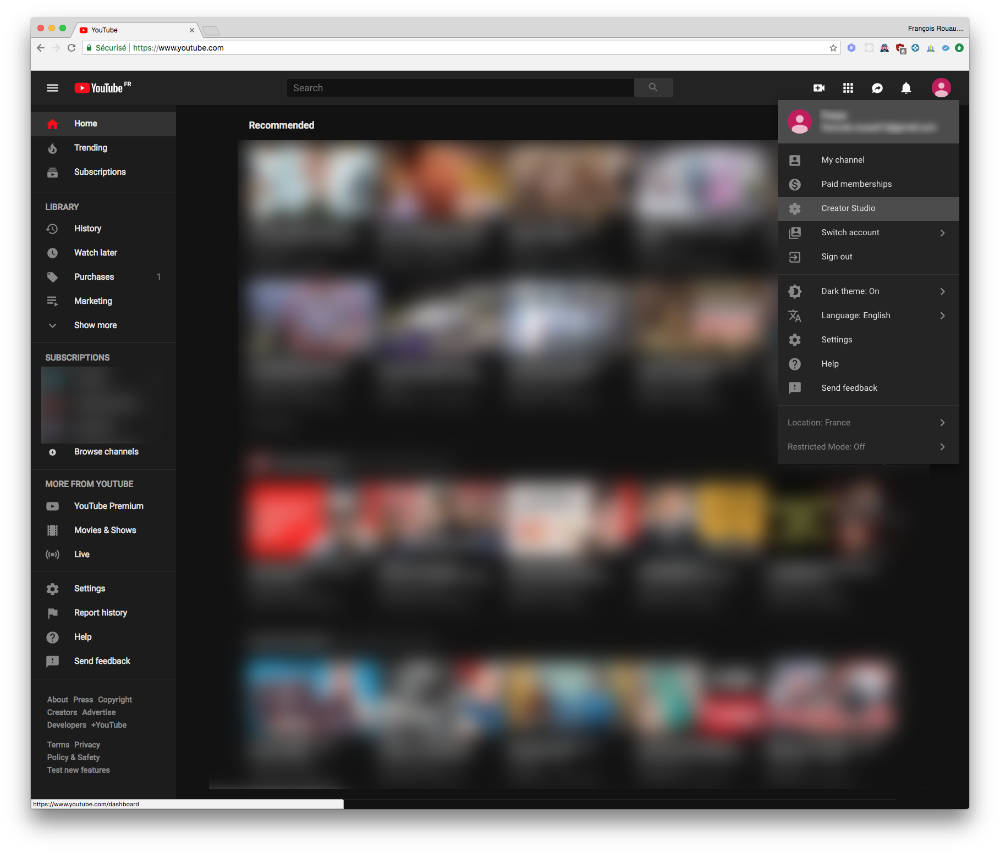
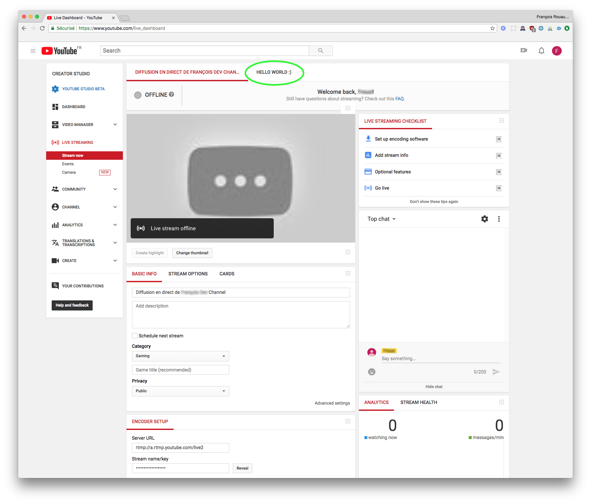
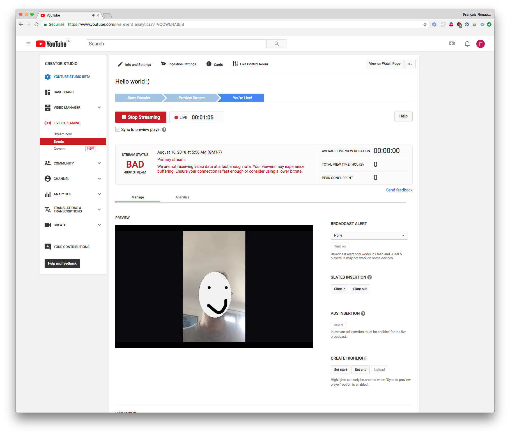

# Hello Firekast 🚀

This **iOS app** features a streamer and a player and illustrate how to make live streaming in seconds with Firekast iOS SDK.

1. Git clone this project.
2. Run `pod install`.
3. Modify `AppDelegate.swift` with your Firekast app's credentials. Visit our [dashboard](https://dashboard.firekast.io/) if you don't have yet and starts using Firekast **for free**.
4. Run the code on your favorite mobile device.

In the app, make a live stream in the 1st tab. When you are done, stop the live, go on the 2nd tab and watch your stream whether its live or VOD, the player will figure it out. You can also watch and manage the stream in the [dashboard](https://dashboard.firekast.io/). 

Note, the player will automagically figures out whether the stream is live or VOD and will adapt its UI accordingly.

Happy live stream!  🎥

## Firekast SDK

### Documentation

Firekast SDK is 100% documented.

Developer documentation can be found at [docs.firekast.io](https://docs.firekast.io).

In addition, if needed, the full iOS API reference can be found [here](https://firekast.io/sdk/ios/docs/).

### Release notes

Firekast SDK release notes can be found [here](https://docs.firekast.io/?swift#release-notes).

## Youtube Live Stream

### SDK 1.6.0 and above

We decided to let you choose the platform to which you want to live stream. You no longer rely on our implementation, provide us with the RTMP link and that's it.

### SDK 1.5.0 and below

#### Setup

1. In the app, set your Google Sign In credentials in `AppDelegate.swift` and `Info.plist`. Follow steps https://developers.google.com/identity/sign-in/ios/start-integrating to get your Google OAuth client ID.
2. In your project Google API Console, enable Youtube Data API v3.
3. In Youtube website, access Studio Creator and enable Live Streaming. 

#### Youtube live streaming in action

1. In the app, click "Google Sign In" button. Once signed-in to Google, switch on the top right button to enable Youtube Live.

2. Then, access Studio Creator from Youtube

3. Click Live Streaming tab and refresh until you see your live stream. In the demo app, the live stream title is "Hello world!" but it can be set in code to whatever you like.

4. Click the "Hello world!" tab to watch your live. On the following screenshot the stream is BAD because I made the stream in bad network condition for the test :)

#### Troubleshootings

- The following error is because you did not activate Youtube Data API v3 in the Google API Console. You will need to logout and sign-in again to re-new your token.

`Firekast start stream error: Youtube error: Access Not Configured. YouTube Data API has not been used in project 796*****765 before or it is disabled. Enable it by visiting https://console.developers.google.com/apis/api/youtube.googleapis.com/overview?project=796*****765 then retry. If you enabled this API recently, wait a few minutes for the action to propagate to our systems and retry. (code: 4)`
