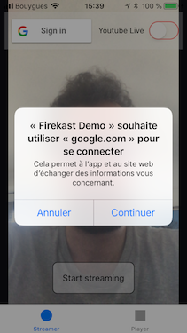

# Hello Firekast 🚀

This simple **iOS app** demonstrates how easy to use is the Firekast iOS SDK.

1. Git clone this project
2. Run `pod install`
3. Modify `AppDelegate.swift` with your credentials. *Visit our [dashboard](https://dashboard.firekast.io/) if you don't have yet.*
4. Run the code on your favorite mobile device

Within the app,  make a live stream in the first tab (the longer the better 😎). When you are done watch your live in the second tab. Note, the player is able to play either live or VOD, it automagically figures it out.

Happy live stream!  🎥

## Youtube Live Stream

### Setup

1. In the app, set your Google Sign In credentials in `AppDelegate.swift` and `Info.plist`. Follow steps https://developers.google.com/identity/sign-in/ios/start-integrating to get your Google OAuth client ID.
2. In your project Google API Console, enable Youtube Data API v3.
3. In Youtube website, access Studio Creator and enable Live Streaming. 

### Youtube live streaming in action

1. In the app, click "Google Sign In" button. Once signed-in to Google, switch on the top right button to enable Youtube Live.

2. Then, access Studio Creator from Youtube

3. Click Live Streaming tab and refresh until you see your live stream. In the demo app, the live stream title is "Hello world!" but it can be set in code to whatever you like.

4. Click the "Hello world!" tab to watch your live. On the following screenshot the stream is BAD because I made the stream in bad network condition for the test :)

### Troubleshootings

- The following error is because you did not activate Youtube Data API v3 in the Google API Console. You will need to logout and sign-in again to re-new your token.

`Firekast start stream error: Youtube error: Access Not Configured. YouTube Data API has not been used in project 796*****765 before or it is disabled. Enable it by visiting https://console.developers.google.com/apis/api/youtube.googleapis.com/overview?project=796*****765 then retry. If you enabled this API recently, wait a few minutes for the action to propagate to our systems and retry. (code: 4)`
